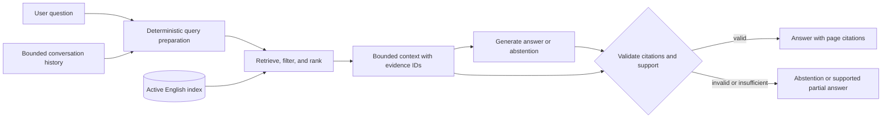
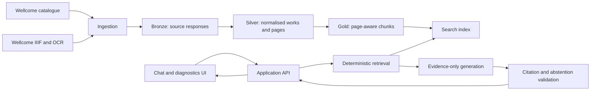

# Architecture

## Purpose of this document

This began as the Phase 1 architecture contract for HeritageRAG. It describes
the boundaries later phases must preserve. The repository is now implemented
through the Bronze and Silver data layers; Gold chunking, indexing, retrieval,
generation, and citation validation remain future work. The exact current
state is recorded in [Project status](project-status.md).

## Baseline request flow

The baseline is deterministic two-step RAG: the application retrieves a
bounded evidence set, then a generator answers from that set. The generator
does not browse, choose tools, or retrieve additional material.



For a follow-up question, conversation history may be used only to produce a
standalone query. The current turn must retrieve its own evidence. Previous
assistant messages never enter the evidence set merely because they are in
history.

## Two independently evaluated boundaries

```text
Question
   |
   v
[Step 1: retrieval] -- ranked chunks + provenance --> retrieval evaluation
   |
   v
[Step 2: answer] ---- claims + citations ---------> answer evaluation
   |
   v
validated answer OR abstention
```

Step 1 owns query preparation, metadata filters, ranking, and bounded context
selection. Its primary initial metric is Recall@10 on labelled relevant pages.

Step 2 owns grounded synthesis, claim-to-citation placement, and abstention. It
is measured for citation coverage, citation validity, citation support, and
correct abstention. This separation prevents a fluent answer from masking a
retrieval failure and prevents a strong retrieval score from masking an
unsupported answer.

## Evidence data boundary

Every chunk admitted to answer context must carry at least:

| Field | Purpose |
|---|---|
| `chunk_id` | Stable identity used by generation and citation validation |
| `work_id` | Links the passage to one Wellcome work |
| `title` | Human-readable citation label |
| `page_start` / `page_end` | Inclusive page locator; canvas/image indices retained separately when needed |
| `text` | Retrieved OCR passage supplied to generation |
| `source_url` | Route back to the digitised source |
| `licence` | Rights provenance and eligibility check |
| `corpus_version` / `index_version` | Makes results reproducible and debuggable |

The citation validator rejects an unknown chunk ID, a citation not present in
the current context, or missing work/page provenance. The complete semantic
rules are defined in [Scope and evidence contract](scope-and-evidence-contract.md).

## Progressive data and application flow

The project implements this target progressively. Bronze and Silver are
complete; downstream boxes remain planned:



Bronze, Silver, and Gold layers keep raw input, cleaned page data, and retrieval
chunks inspectable. The important RAG behaviour—source traversal, chunking,
ranking, context selection, citation validation, and abstention—will remain
explicit in project code instead of being hidden in an opaque agent chain.

## Low-fidelity UI sketch

Phase 1 defines layout and information needs only. It does not create a
frontend.

```text
+------------------------------------------------------------------------------+
| HeritageRAG                    [Chat] [Pipeline]          Corpus: english-v1   |
+----------------------------------------------+-------------------------------+
| CHAT                                         | SOURCES                       |
|                                              |                               |
| You: What did [work] say about sanitation?   | [1] Work title               |
|                                              |     pages 42-44               |
| Assistant: The author argued ... [1]         |     supporting OCR passage   |
| A second claim ... [2]                       |     [open digitised page]     |
|                                              |                               |
| [Not enough evidence to answer ...]          | [2] Work title, pages 51-52  |
|                                              |                               |
| [ Ask a question...                    Send ]| [show retrieval details]      |
+----------------------------------------------+-------------------------------+
| PIPELINE DASHBOARD                                                           |
| Query rewrite  ->  retrieve  ->  rerank  ->  generate  ->  validate          |
| complete           10 hits      complete     complete      2/2 valid          |
| 120 ms              430 ms       260 ms       1.8 s         8 ms              |
| Filters: language=en, period=1850..1899 | index=... | trace=...              |
+------------------------------------------------------------------------------+
```

The normal chat view prioritises the answer and sources. Pipeline details are
available for learning and diagnosis without being treated as source evidence.

## Architectural constraints

- The initial corpus is English, public-domain, digitised Wellcome books with
  usable OCR and provenance.
- Retrieval is bounded to the active, versioned corpus; the generator has no
  autonomous web or tool access.
- Substantial claims require current-turn page evidence.
- Metadata may constrain discovery but cannot silently substitute for required
  page evidence.
- Retrieved text is untrusted reference material and cannot change system
  instructions.
- Insufficient or invalid evidence terminates in partial answer or abstention.
- French and Dutch require separate evaluation slices before release.
- Search and generation latency are recorded separately.

## Deferred choices

Phase 1 does not select an embedding model, vector database configuration,
chunk size, reranker, language model, prompt, or abstention score threshold.
Those choices require real data and measured comparisons. The target technology
stack in the learning guide is directional, not evidence that these components
already exist.
