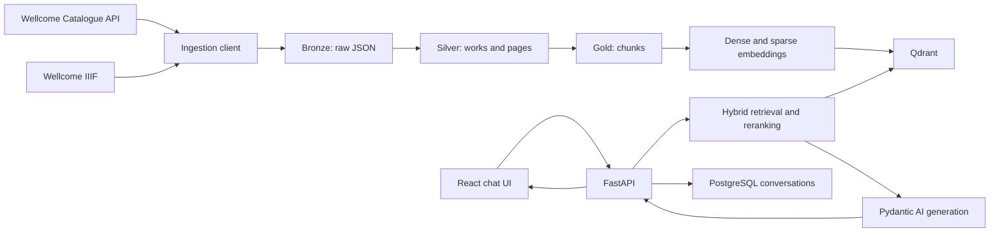

# HeritageRAG Development and Learning Guide

## 1. Purpose of this guide

This document is the working playbook for building **HeritageRAG**, a production-oriented multilingual retrieval-augmented generation application based initially on digitised public-domain material from the Wellcome Collection.

The project has two equally important goals:

1. Learn the mechanics and engineering trade-offs of a real RAG system.
2. Produce a small, understandable GitHub portfolio project that can be explained and defended in a technical interview.

The project will be developed incrementally. We will start with a very small dataset and a small codebase. We will only add infrastructure, frameworks, abstractions, and scale when a concrete requirement justifies them.

The final product will include:

- A multilingual chat interface.
- Wellcome catalogue metadata and IIIF OCR ingestion.
- Bronze, Silver, and Gold data layers.
- Page-aware chunking.
- Dense and sparse hybrid retrieval.
- Reranking.
- Page-level citations.
- Evidence-based abstention.
- Conversation history.
- Retrieval and ingestion diagnostics in the UI.
- Evaluation, monitoring, tests, and production deployment documentation.

---

## 2. Project statement

> HeritageRAG helps users explore European medical, scientific, social, and cultural history through digitised public-domain documents from the Wellcome Collection. It answers questions using retrieved evidence, cites the relevant work and page, and abstains when the available evidence is insufficient.

Initial scope:

- Primary data source: Wellcome Collection.
- Material: digitised public-domain books with metadata, page images, and OCR where available.
- Initial language: English.
- Later languages: French and Dutch.
- Development dataset: 5 to 100 works.
- Portfolio dataset: approximately 250 to 500 works.
- Retrieval unit: page-aware text chunk.
- Required provenance: work ID, title, page range, source URL, and licence.

Out of scope for the first complete version:

- Autonomous web browsing.
- User-uploaded documents.
- Multiple museum sources.
- Image embeddings.
- A fully autonomous agent.
- Kubernetes.
- Microservices.
- Large-scale distributed processing.

These can become later extensions, but they must not delay the understandable baseline.

---

## 3. Working agreement: one chat per phase

Each development phase will have a separate chat and a fresh context window. A phase may require several messages, coding iterations, and debugging cycles, but the next phase starts only after the current phase meets its exit criteria.

Every phase uses two passes:

1. **Elaboration pass:** before implementation begins, explain the complete
   phase from entry criteria to exit criteria. List every meaningful step and
   its substeps, dependencies, expected files, decisions, verification
   checkpoints, documentation, and handoff work.
2. **Execution pass:** after the learner has reviewed the complete phase path,
   work through it one meaningful implementation step at a time.

Do not begin coding while the phase path is still implicit. Conversely, do not
turn the execution pass into a conversation about individual housekeeping
commands. Formatting, Ruff, mypy, Git status, Git diff, and similar checks are
supporting verification actions that should normally be grouped into the
relevant checkpoint.

### 3.1 Responsibilities in each phase

The assistant will:

- Explain the concept and its relevance before suggesting code.
- Explain important design choices and rejected alternatives.
- Elaborate the complete phase, including all meaningful steps and substeps,
  before proposing the first implementation action.
- Suggest code in small, reviewable increments for the learner to enter.
- After phase elaboration, present one meaningful implementation outcome at a
  time and wait for its result before continuing.
- Identify the exact path for every file.
- Prefer complete file contents for small files and focused patches for existing files.
- Explain commands before asking the learner to run them.
- Provide tests alongside important behaviour.
- Help diagnose command output and errors pasted back into the chat.
- Resolve a failed command or test before introducing the next feature.
- Avoid introducing unexplained abstractions.
- Draft one ADR for the phase.
- End the phase with a consolidated verification checkpoint and handoff summary.
- Leave application source, tests, configuration, container files, Git staging,
  commits, and pushes to the learner.
- Edit Markdown documentation only when the learner explicitly requests it.
- Treat guided learning as the default operating mode. Read-only inspection is
  allowed, but editing files or running state-changing commands requires an
  explicit learner request.
- Accept a temporary change of operating mode when the learner explicitly asks
  the assistant to implement a bounded task. State the scope, complete its
  verification, and then return control to the learner.
- Preserve existing files and uncommitted work; do not move, delete, or rewrite
  unrelated content.

The learner will:

- Create the files and copy the generated code into the repository.
- Run the commands locally.
- Read the explanation before moving to the next step.
- Paste errors and relevant output back into the same phase chat.
- Ask questions when a decision or line of code is unclear.
- Verify the phase exit criteria.
- Commit the completed phase and its ADR.
- Start a fresh chat for the next phase with the handoff context.
- Explicitly request any documentation edit that the assistant should perform.
- Explicitly request a temporary implementation mode when the assistant should
  edit or run the current bounded task instead of only guiding it.

### 3.2 Code delivery rules

To keep the project understandable:

- Suggest no more than one to three related files at a time.
- Define a step as one cohesive behavior, boundary, or vertical slice. A step
  may include closely related functions, tests, configuration, and commands
  across one to three files when separating them would create artificial
  conversational overhead.
- Every code delivery must contain:
  1. What the code does.
  2. Why it belongs in that file.
  3. Important implementation decisions.
  4. The code itself.
  5. A command or test that proves it works.
- Prefer normal Python functions over framework-specific chains.
- Prefer composition over inheritance.
- Do not add an interface until there are at least two implementations or a clear test boundary.
- Do not add a framework solely because it is popular.
- Apply SOLID principles and design patterns only when they clarify a current
  responsibility or test boundary; do not add patterns for hypothetical needs.
- Never place API keys or secrets in code or Git.

### 3.3 Phase chat starter template

Start every new phase chat with the following message, adapted to the current
phase. When the assistant can access the repository, it must read these files
directly instead of asking the learner to paste their contents.

```text
We are starting Phase X - <phase name> of HeritageRAG.

Before proposing work, read:
- docs/learning-guide-agreement.md
- docs/scope-and-evidence-contract.md
- docs/project-status.md
- docs/building_phases/phase-XX-<name>.md
- docs/building_guides/README.md and relevant completed phase guides
- docs/adr/README.md and relevant ADRs

Inspect the actual repository tree, pyproject.toml, lockfile, tests, and Git
status. The repository and durable documentation are the source of truth; do
not rely on previous-chat memory or recreate work that already exists.

I write implementation code, tests, configuration, and container files. I run
commands and control Git. First elaborate the complete phase with every
meaningful step and substep, expected files, dependencies, decisions,
verification checkpoints, documentation, and exit criteria. Wait for me to
review that phase path. Then guide me through one meaningful implementation
outcome at a time with the exact path, code or command, explanation, and
expected result. Edit Markdown documentation only when I explicitly ask. Use
SOLID principles or design patterns only when the current requirement justifies
them.

Default to guided mode. You may inspect files and Git state, but do not edit
files or run state-changing commands unless I explicitly ask you to implement
a bounded task. A request for a plan, explanation, review, or diagnosis is not
authorization to make changes.

Begin by comparing the phase entry criteria with the actual repository state,
then present the complete ordered phase path. Do not start its first
implementation step until the elaboration pass is complete.
```

If the assistant cannot access the repository, the learner provides the listed
documents, a shallow tree, `git status --short`, and relevant file contents.

### 3.4 Required phase handoff

At the end of every phase, update `docs/project-status.md`:

```markdown
# Project status

## Current state

- Last completed phase:
- Current branch:
- Dataset size:
- Active index version:
- Last successful command:

## Completed capabilities

- ...

## Verification results

- Tests:
- Linting:
- Manual checks:

## Important decisions

- ADR links:

## Known limitations

- ...

## Next phase

- Phase:
- Entry conditions:
- First intended task:
```

This file is the main bridge between separate chat context windows.

Also update the phase build guide under `docs/building_guides/` with what was
actually implemented, how each module works, frameworks used, verification,
and current limitations. The phase plan remains a plan; the build guide is the
implementation review.

### 3.5 Idempotent chat protocol

For this project, an idempotent conversation means that restarting a phase chat
against the same repository state produces the same next missing step and does
not duplicate code, dependencies, documentation, or Git history.

At the start of a phase or after lost context, the assistant must:

1. Read the working agreement, scope contract, project status, current phase
   plan, completed build guides, and relevant ADRs.
2. Inspect the actual files, dependency declarations, lockfile, tests, and Git
   status before suggesting changes.
3. Treat repository contents as authoritative when chat memory and files differ.
4. Identify completed, partially completed, and missing phase items.
5. Continue from the first missing item rather than regenerating the phase.
6. Preserve unrelated and uncommitted learner changes.

Before suggesting a state-changing action, check whether its result already
exists:

- search for a file or symbol before creating it;
- inspect `pyproject.toml` before adding a dependency;
- inspect existing tests before proposing another test;
- update an existing document instead of creating a duplicate; and
- inspect Git status and diffs before staging or discussing a commit.

Commands should be safe to repeat when practical. Tests, lint checks, type
checks, lock checks, builds, and configuration validation are repeatable.
Formatting, dependency changes, container creation, deletion, and data changes
must be described as state-changing. Destructive actions require an explicit
learner request and exact target verification.

### 3.6 Default step format

After the complete phase has been elaborated, each implementation step should
normally contain:

1. **Goal:** the single behavior or boundary being added.
2. **Path:** the exact file being created or changed.
3. **Code or command:** only the current increment.
4. **Explanation:** how it works and why it is appropriate now.
5. **Verification checkpoint:** the focused behavior check plus any closely
   related quality commands that should be run together.
6. **Expected result:** what success should look like.

After the learner reports success, move to the next step. After a coherent
group of changes, run the full checks and let the learner review, stage, commit,
and push them. A failed result pauses progression until it is understood and
resolved.

The unit of progress is one meaningful behavior or boundary, not one shell
command. Installing a dependency, formatting a file, running Ruff or mypy,
printing Git status, viewing a diff, and repeating a file listing are normally
substeps or checkpoint actions, not standalone learning steps. Group routine
checks with the behavior they validate and batch the full quality suite at a
coherent checkpoint. A failed check may temporarily become the focus because
it must be diagnosed before progress continues.

### 3.7 Repeatable phase cadence

Every phase follows the same five-stage rhythm. This keeps the pace familiar
while allowing the technical content to change.

#### Stage 1: Orient from repository evidence

1. Read the agreement, scope contract, project status, current phase plan,
   completed build guides, and relevant ADRs.
2. Inspect the repository tree, dependency declarations, lockfiles, tests, and
   Git status.
3. Compare the phase entry criteria with the actual repository state.
4. Summarise what is complete, partial, missing, and unrelated before proposing
   work.

Do not regenerate a scaffold, dependency, test, document, or decision that is
already present. If chat history conflicts with the repository, the repository
wins.

#### Stage 2: Elaborate and agree the complete phase path

Before any implementation action:

1. State the phase objective, entry criteria, exit criteria, and deliberate
   exclusions.
2. Present every meaningful implementation step in dependency order.
3. Expand each step into its required substeps without turning routine tool
   commands into separate roadmap items.
4. Name the expected files, responsibilities, architectural decisions, and
   verification checkpoint for each step.
5. Include the final quality pass, manual acceptance path, documentation, ADR,
   project-status update, and Git handoff.
6. Confirm any choice that would materially change architecture or scope.
7. Wait for the learner to review the complete phase path before beginning the
   first implementation step.

The elaboration pass must be sufficiently complete that the learner can see how
the phase reaches its exit criteria before entering any code. It gives
orientation and predictability; it is not permission to execute every item at
once. Guided mode still advances one meaningful outcome at a time after the
roadmap is agreed.

#### Stage 3: Build in learning-sized increments

For each increment:

1. Explain the concept and the reason it is needed now.
2. Show the exact path and focused code or command.
3. Let the learner apply it, unless temporary implementation mode was requested.
4. Run or request the focused verification checkpoint that proves the behavior;
   keep its routine lint, formatting, type, and diff commands together.
5. Interpret the result and resolve failures before adding another behavior.

Prefer a working vertical slice over several disconnected foundations. When an
error occurs, inspect the exact current file, command output, runtime state, and
tool configuration before proposing a fix. Do not stack speculative fixes.

#### Stage 4: Consolidate the implementation

After the planned behaviors work:

1. Run the complete test, lint, formatting, type, build, and configuration
   checks relevant to the phase.
2. Exercise the primary user or operator path manually where automation does
   not provide sufficient evidence.
3. Review Git status and the complete diff, separating phase changes from
   unrelated learner work.
4. Correct inconsistencies as one review pass rather than interleaving new
   features with cleanup.

Only measured results may be recorded as verification evidence.

#### Stage 5: Close and hand off the phase

Complete the durable records in this order:

1. Update the user-facing `README.md` only when the phase changes user-visible
   capabilities, audience guidance, limitations, or documentation links. Keep
   detailed implementation instructions in the build guide.
2. Create or update the phase implementation guide from the actual code.
3. Create the phase ADR and update the ADR index.
4. Update `docs/project-status.md` with verified results, limitations, and the
   next phase entry conditions.
5. Run documentation and repository checks, then provide a concise handoff.
6. Let the learner review, stage, commit, and push unless those Git actions were
   explicitly delegated.

The next phase does not begin until the current exit criteria and handoff are
complete.

### 3.8 Phase implementation-guide standard

The build guide is the phase's concise technical review. It describes what was
actually implemented; it must not copy the phase plan or become a chronological
task diary.

Use the reusable structure in `docs/building_guides/README.md`. By default, a
phase guide should include:

1. **Phase at a glance:** outcome, technologies, and deliberate exclusions.
2. **Runtime flow:** how the phase's components interact.
3. **Framework and tool inventory:** what each dependency does and why it was
   selected now.
4. **File-by-file review:** every meaningful source and test file changed by the
   phase, including the responsibility of each important class, function,
   fixture, and test. Explain behavior and boundaries without paraphrasing every
   line.
5. **Operational tooling:** the relevant dependency manager, lockfile,
   container image, Compose service, data command, or infrastructure concern.
6. **Verification:** exact commands and the property each command proves.
7. **Review summary:** what is ready to keep, current limitations, and what
   evidence would justify revisiting the design.
8. **Official references:** links for externally maintained framework behavior.

Prefer numbered sections, short paragraphs, comparison tables, and small code
examples. Define a term before using it in a design argument. Be concise, but do
not omit a source file, test boundary, framework, or operational mechanism that
the learner must be able to explain in an interview.

The documentation areas remain deliberately separate:

- `README.md` explains the product to users and reviewers.
- `docs/building_phases/` records intended scope and exit criteria.
- `docs/building_guides/` reviews the resulting implementation.
- `docs/adr/` records durable decisions, alternatives, and consequences.
- `docs/project-status.md` is the restart and next-chat handoff state.

This separation is part of idempotency: a new chat updates the existing durable
record for its purpose instead of creating a competing summary.

---

## 4. Architecture principles

### 4.1 Keep the important RAG logic visible

The following logic should be implemented explicitly in the repository so it can be learned and defended:

- Source discovery and pagination.
- IIIF manifest traversal.
- OCR reconstruction and cleaning.
- Data validation and lineage.
- Chunk boundary selection.
- Dense and sparse retrieval.
- Reciprocal Rank Fusion.
- Metadata filtering.
- Reranking.
- Context selection.
- Citation validation.
- Abstention.
- Retrieval evaluation.

Libraries may provide HTTP clients, model inference, storage, and database access, but the project must not hide the core behaviour behind an opaque RAG chain.

### 4.2 Framework policy

- **LangChain:** not used in the initial implementation. The Wellcome source adapter and retrieval pipeline are custom and explicit.
- **LangGraph:** not used in the deterministic baseline. It may be added later for an evaluated agentic-RAG experiment with retry loops or multiple sources.
- **Pydantic AI:** introduced only in the answer-generation phase for typed dependencies, model-provider integration, validated output, and streaming.
- **FastAPI:** used for HTTP endpoints and streaming.
- **React with TypeScript and Vite:** used for the chat and diagnostics UI.

### 4.3 Progressive scale

Use the smallest useful dataset at each stage:

| Stage | Dataset size | Purpose |
|---|---:|---|
| Automated fixture | 1–2 works | Fast repeatable tests |
| Ingestion smoke test | 5 works | Validate API and storage |
| Data-cleaning development | 20–25 works | Discover real anomalies |
| Retrieval development | 50–100 works | Build and inspect search |
| Portfolio evaluation | 250–500 works | Meaningful final demonstration |

Do not ingest the full catalogue during development.

### 4.4 Target architecture



---

## 5. Technology stack

### Backend

- Python 3.12
- `uv` for Python and dependency management
- FastAPI and Uvicorn
- Pydantic and Pydantic Settings
- HTTPX and Tenacity
- Typer for pipeline commands
- Polars and PyArrow for tabular processing and Parquet
- Qdrant client
- A multilingual dense embedding model
- Sparse BM25-style retrieval
- A multilingual reranker
- Pydantic AI for generation
- SQLAlchemy, Alembic, and PostgreSQL for conversations
- Structlog and OpenTelemetry-compatible instrumentation

### Frontend

- React
- TypeScript
- Vite
- A small typed API client
- Server-Sent Events for chat and job progress
- Plain CSS or a very small component layer initially

### Development and operations

- Docker Compose
- pytest, pytest-asyncio, and respx
- Ruff and mypy
- Browser end-to-end tests later
- GitHub Actions
- Object storage in production; local filesystem during development

---

## 6. Planned repository structure

The structure will grow progressively. Do not create empty modules before their phase requires them.

```text
european-heritage-rag/
├── src/
│   └── european_heritage_rag/
│       ├── api/
│       ├── core/
│       │   ├── config.py
│       │   └── logging.py
│       ├── domain/
│       ├── generation/
│       ├── pipeline/
│       ├── retrieval/
│       ├── sources/
│       │   └── wellcome/
│       ├── __init__.py
│       └── cli.py
├── tests/
│   ├── fixtures/
│   ├── integration/
│   └── unit/
├── frontend/
│   ├── src/
│   │   ├── api/
│   │   ├── components/
│   │   ├── features/
│   │   └── pages/
│   └── package.json
├── data/
│   ├── bronze/
│   ├── silver/
│   └── gold/
├── docs/
│   ├── adr/
│   ├── building_phases/
│   ├── evaluation/
│   ├── architecture.md
│   ├── learning-guide-agreement.md
│   ├── project-status.md
│   └── scope-and-evidence-contract.md
├── .env.example
├── .gitignore
├── .python-version
├── compose.yaml
├── pyproject.toml
├── uv.lock
├── README.md
└── LICENSE
```

The Python backend lives at the repository root because it is the first
application and currently owns the primary development workflow. The React
application will later live in `frontend/`, while shared project documentation,
data directories, environment configuration, and Docker Compose remain at the
root.

Python modules are added only when their phase requires them. `core/` is
reserved for cross-cutting application concerns such as configuration and
logging; historical-source, retrieval, and generation behaviour must remain in
their dedicated packages.

`data/` must be excluded from Git except for deliberately small test fixtures.

---

## 7. Architectural Decision Records

One ADR is required for every phase. An ADR records a meaningful decision and its consequences; it is not a diary of tasks performed.

Store ADRs in `docs/adr/` with sequential names:

```text
docs/adr/0001-project-scope-and-evidence-contract.md
docs/adr/0002-development-environment.md
...
```

### ADR template

```markdown
# ADR-XXXX: Decision title

- Status: Accepted
- Date: YYYY-MM-DD
- Phase: Phase X — Name

## Context

What problem or decision did this phase introduce? What constraints matter?

## Decision

What did we choose?

## Alternatives considered

### Alternative A

What was considered, and why was it not selected?

### Alternative B

What was considered, and why was it not selected?

## Consequences

### Positive

- ...

### Negative or accepted trade-offs

- ...

## Validation

How will we know this decision works?

## Revisit when

What future evidence or requirement would justify changing the decision?
```

Maintain `docs/adr/README.md` as an ADR index.

---
