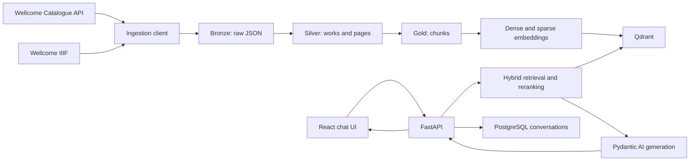

# HeritageRAG Development and Learning Guide

## 1. Purpose of this guide

This document is the working playbook for building **HeritageRAG**, a production-oriented multilingual retrieval-augmented generation application based initially on digitised public-domain material from the Wellcome Collection.

The project has two equally important goals:

1. Learn the mechanics and engineering trade-offs of a real RAG system.
2. Produce a small, understandable GitHub portfolio project that can be explained and defended in a technical interview.

The project will be developed incrementally. We will start with a very small dataset and a small codebase. We will only add infrastructure, frameworks, abstractions, and scale when a concrete requirement justifies them.

The final product will include:

- A multilingual chat interface.
- Wellcome catalogue metadata and IIIF OCR ingestion.
- Bronze, Silver, and Gold data layers.
- Page-aware chunking.
- Dense and sparse hybrid retrieval.
- Reranking.
- Page-level citations.
- Evidence-based abstention.
- Conversation history.
- Retrieval and ingestion diagnostics in the UI.
- Evaluation, monitoring, tests, and production deployment documentation.

---

## 2. Project statement

> HeritageRAG helps users explore European medical, scientific, social, and cultural history through digitised public-domain documents from the Wellcome Collection. It answers questions using retrieved evidence, cites the relevant work and page, and abstains when the available evidence is insufficient.

Initial scope:

- Primary data source: Wellcome Collection.
- Material: digitised public-domain books with metadata, page images, and OCR where available.
- Initial language: English.
- Later languages: French and Dutch.
- Development dataset: 5 to 100 works.
- Portfolio dataset: approximately 250 to 500 works.
- Retrieval unit: page-aware text chunk.
- Required provenance: work ID, title, page range, source URL, and licence.

Out of scope for the first complete version:

- Autonomous web browsing.
- User-uploaded documents.
- Multiple museum sources.
- Image embeddings.
- A fully autonomous agent.
- Kubernetes.
- Microservices.
- Large-scale distributed processing.

These can become later extensions, but they must not delay the understandable baseline.

---

## 3. Working agreement: one chat per phase

Each development phase will have a separate chat and a fresh context window. A phase may require several messages, coding iterations, and debugging cycles, but the next phase starts only after the current phase meets its exit criteria.

### 3.1 Responsibilities in each phase

The assistant will:

- Explain the concept and its relevance before generating code.
- Explain important design choices and rejected alternatives.
- Generate code in small, reviewable increments.
- Identify the exact path for every file.
- Prefer complete file contents for small files and focused patches for existing files.
- Explain commands before asking the learner to run them.
- Provide tests alongside important behaviour.
- Help diagnose command output and errors pasted back into the chat.
- Avoid introducing unexplained abstractions.
- Draft one ADR for the phase.
- End the phase with verification steps and a handoff summary.

The learner will:

- Create the files and copy the generated code into the repository.
- Run the commands locally.
- Read the explanation before moving to the next step.
- Paste errors and relevant output back into the same phase chat.
- Ask questions when a decision or line of code is unclear.
- Verify the phase exit criteria.
- Commit the completed phase and its ADR.
- Start a fresh chat for the next phase with the handoff context.

### 3.2 Code delivery rules

To keep the project understandable:

- Generate no more than one to three related files at a time.
- Every code delivery must contain:
  1. What the code does.
  2. Why it belongs in that file.
  3. Important implementation decisions.
  4. The code itself.
  5. A command or test that proves it works.
- Prefer normal Python functions over framework-specific chains.
- Prefer composition over inheritance.
- Do not add an interface until there are at least two implementations or a clear test boundary.
- Do not add a framework solely because it is popular.
- Never place API keys or secrets in code or Git.

### 3.3 Phase chat starter template

Start every new phase chat with the following message, adapted to the current phase:

```text
We are building HeritageRAG, a production-oriented multilingual RAG project
using digitised public-domain Wellcome Collection books.

We work one phase per chat. I copy the code into my repository and run it.
Please explain concepts and decisions before generating small code increments.
Do not introduce unnecessary abstractions. We must create one ADR for this phase.

Current phase: Phase X — <phase name>

Current project status:
<paste docs/project-status.md>

Relevant previous ADRs:
<paste or link the most relevant ADRs>

Current repository tree:
<paste a shallow repository tree>

Please begin by reviewing the entry criteria and proposing the first small step.
```

### 3.4 Required phase handoff

At the end of every phase, update `docs/project-status.md`:

```markdown
# Project status

## Current state

- Last completed phase:
- Current branch:
- Dataset size:
- Active index version:
- Last successful command:

## Completed capabilities

- ...

## Verification results

- Tests:
- Linting:
- Manual checks:

## Important decisions

- ADR links:

## Known limitations

- ...

## Next phase

- Phase:
- Entry conditions:
- First intended task:
```

This file is the main bridge between separate chat context windows.

---

## 4. Architecture principles

### 4.1 Keep the important RAG logic visible

The following logic should be implemented explicitly in the repository so it can be learned and defended:

- Source discovery and pagination.
- IIIF manifest traversal.
- OCR reconstruction and cleaning.
- Data validation and lineage.
- Chunk boundary selection.
- Dense and sparse retrieval.
- Reciprocal Rank Fusion.
- Metadata filtering.
- Reranking.
- Context selection.
- Citation validation.
- Abstention.
- Retrieval evaluation.

Libraries may provide HTTP clients, model inference, storage, and database access, but the project must not hide the core behaviour behind an opaque RAG chain.

### 4.2 Framework policy

- **LangChain:** not used in the initial implementation. The Wellcome source adapter and retrieval pipeline are custom and explicit.
- **LangGraph:** not used in the deterministic baseline. It may be added later for an evaluated agentic-RAG experiment with retry loops or multiple sources.
- **Pydantic AI:** introduced only in the answer-generation phase for typed dependencies, model-provider integration, validated output, and streaming.
- **FastAPI:** used for HTTP endpoints and streaming.
- **React with TypeScript and Vite:** used for the chat and diagnostics UI.

### 4.3 Progressive scale

Use the smallest useful dataset at each stage:

| Stage | Dataset size | Purpose |
|---|---:|---|
| Automated fixture | 1–2 works | Fast repeatable tests |
| Ingestion smoke test | 5 works | Validate API and storage |
| Data-cleaning development | 20–25 works | Discover real anomalies |
| Retrieval development | 50–100 works | Build and inspect search |
| Portfolio evaluation | 250–500 works | Meaningful final demonstration |

Do not ingest the full catalogue during development.

### 4.4 Target architecture



---

## 5. Technology stack

### Backend

- Python 3.12
- `uv` for Python and dependency management
- FastAPI and Uvicorn
- Pydantic and Pydantic Settings
- HTTPX and Tenacity
- Typer for pipeline commands
- Polars and PyArrow for tabular processing and Parquet
- Qdrant client
- A multilingual dense embedding model
- Sparse BM25-style retrieval
- A multilingual reranker
- Pydantic AI for generation
- SQLAlchemy, Alembic, and PostgreSQL for conversations
- Structlog and OpenTelemetry-compatible instrumentation

### Frontend

- React
- TypeScript
- Vite
- A small typed API client
- Server-Sent Events for chat and job progress
- Plain CSS or a very small component layer initially

### Development and operations

- Docker Compose
- pytest, pytest-asyncio, and respx
- Ruff and mypy
- Browser end-to-end tests later
- GitHub Actions
- Object storage in production; local filesystem during development

---

## 6. Planned repository structure

The structure will grow progressively. Do not create empty modules before their phase requires them.

```text
european-heritage-rag/
├── src/
│   └── european_heritage_rag/
│       ├── api/
│       ├── core/
│       │   ├── config.py
│       │   └── logging.py
│       ├── domain/
│       ├── generation/
│       ├── pipeline/
│       ├── retrieval/
│       ├── sources/
│       │   └── wellcome/
│       ├── __init__.py
│       └── cli.py
├── tests/
│   ├── fixtures/
│   ├── integration/
│   └── unit/
├── frontend/
│   ├── src/
│   │   ├── api/
│   │   ├── components/
│   │   ├── features/
│   │   └── pages/
│   └── package.json
├── data/
│   ├── bronze/
│   ├── silver/
│   └── gold/
├── docs/
│   ├── adr/
│   ├── building_phases/
│   ├── evaluation/
│   ├── architecture.md
│   ├── learning-guide-agreement.md
│   ├── project-status.md
│   └── scope-and-evidence-contract.md
├── .env.example
├── .gitignore
├── .python-version
├── compose.yaml
├── pyproject.toml
├── uv.lock
├── README.md
└── LICENSE
```

The Python backend lives at the repository root because it is the first
application and currently owns the primary development workflow. The React
application will later live in `frontend/`, while shared project documentation,
data directories, environment configuration, and Docker Compose remain at the
root.

Python modules are added only when their phase requires them. `core/` is
reserved for cross-cutting application concerns such as configuration and
logging; historical-source, retrieval, and generation behaviour must remain in
their dedicated packages.

`data/` must be excluded from Git except for deliberately small test fixtures.

---

## 7. Architectural Decision Records

One ADR is required for every phase. An ADR records a meaningful decision and its consequences; it is not a diary of tasks performed.

Store ADRs in `docs/adr/` with sequential names:

```text
docs/adr/0001-project-scope-and-evidence-contract.md
docs/adr/0002-development-environment.md
...
```

### ADR template

```markdown
# ADR-XXXX: Decision title

- Status: Accepted
- Date: YYYY-MM-DD
- Phase: Phase X — Name

## Context

What problem or decision did this phase introduce? What constraints matter?

## Decision

What did we choose?

## Alternatives considered

### Alternative A

What was considered, and why was it not selected?

### Alternative B

What was considered, and why was it not selected?

## Consequences

### Positive

- ...

### Negative or accepted trade-offs

- ...

## Validation

How will we know this decision works?

## Revisit when

What future evidence or requirement would justify changing the decision?
```

Maintain `docs/adr/README.md` as an ADR index.

---
